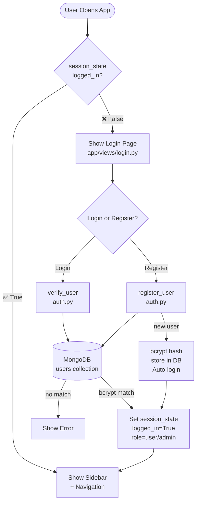
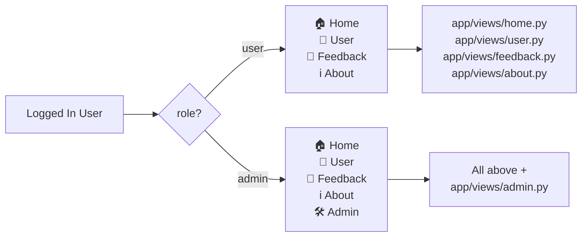
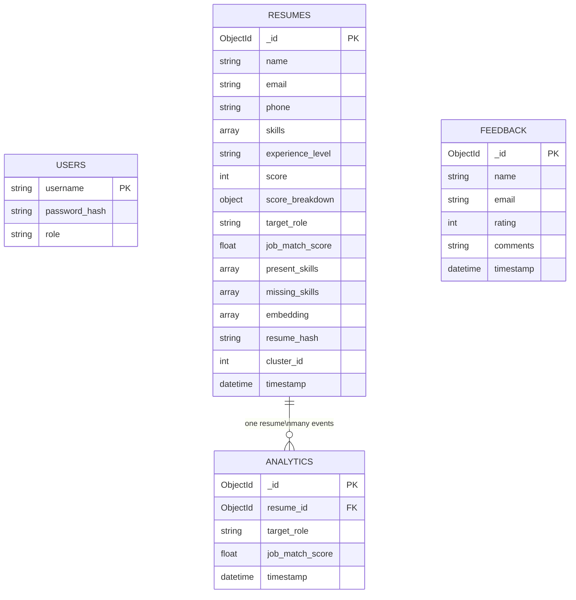
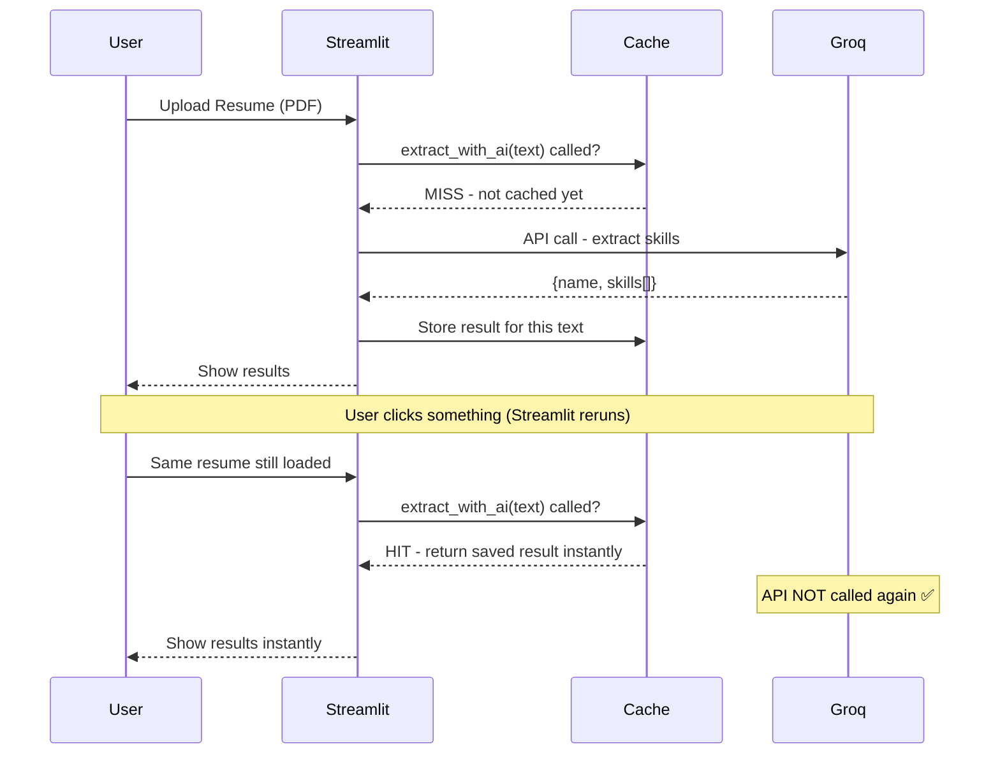
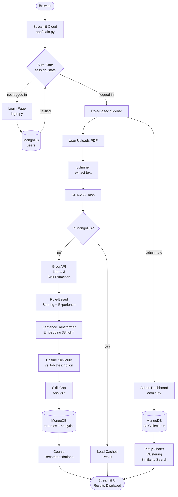
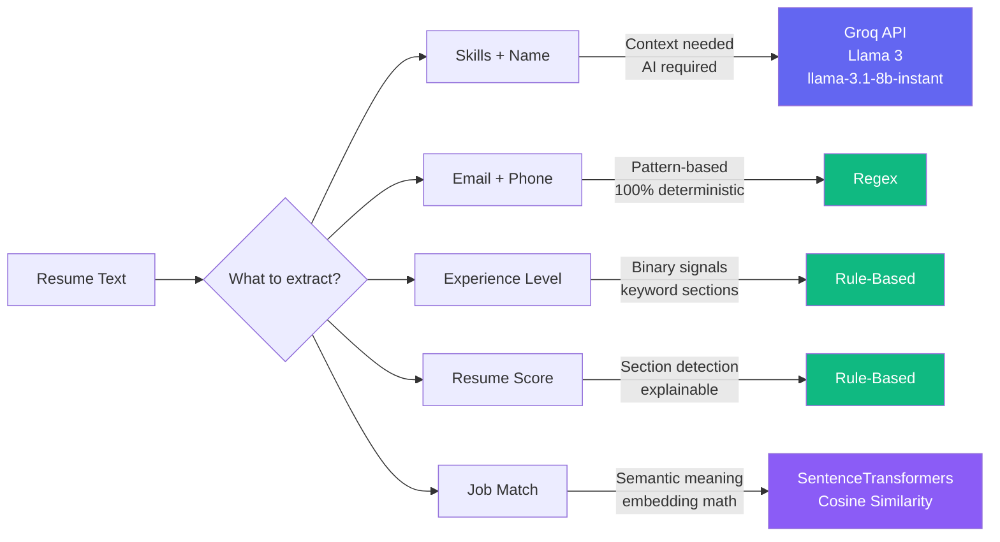

# AI Resume Analyzer — Complete Project Flow

## Entry Point

Everything starts from pp/main.py:

`
streamlit run app/main.py
`

---

## Step 1 — Authentication Gate

`
User opens app
      |
main.py checks: st.session_state.logged_in ?
      |
   No  -> show login_page()  (blocks everything)
   Yes -> show sidebar + navigation
`

### Login / Register Flow (app/views/login.py)

`
User enters username + password
      |
verify_user(username, password)   <- backend/database/auth.py
      |
MongoDB users collection lookup
      |
bcrypt.checkpw(password, stored_hash)
      |
   Match    -> session_state: logged_in=True, username, role -> st.rerun()
   No match -> show error

Register Tab:
      |
register_user(username, password, role=user)
      |
Check username exists in MongoDB
      |
bcrypt.hashpw(password) -> store in DB
      |
Auto-login immediately
`

---

## Step 2 — Role-Based Navigation

`
role == admin  ->  Home | User | Feedback | About | Admin
role == user   ->  Home | User | Feedback | About
`

| Sidebar Option | File |
|---|---|
| Home | app/views/home.py |
| User | app/views/user.py |
| Feedback | app/views/feedback.py |
| About | app/views/about.py |
| Admin | app/views/admin.py |

---

## Step 3 — Resume Analysis Pipeline (app/views/user.py)

`
User uploads PDF
      |
save_uploaded_file()                <- backend/utils/helpers.py
      |
extract_text_from_pdf(path)         <- backend/parser/pdf_reader.py
      |
SHA-256 hash of text
      |
get_resume_by_hash(hash)            <- backend/database/user_data.py
      |
In MongoDB?  -> load cached result (skip re-analysis)
Not in DB?   -> run full pipeline below
`

### Full Analysis Pipeline

`
resume_text
      |
      +-> parse_resume(text)              <- backend/parser/resume_parser.py
      |       |
      |       +-- Groq API (llama-3.1-8b-instant) -> name, skills[]
      |       +-- regex                            -> email
      |       +-- regex                            -> phone
      |
      +-> detect_experience_level(text)   <- backend/analysis/experience_level.py
      |       Rule-based: checks keywords, page count
      |       Result: Fresher / Intermediate / Experienced
      |
      +-> calculate_resume_score(text)    <- backend/analysis/resume_score.py
      |       Section keyword checks: Summary, Education, Skills,
      |       Projects, Experience, Certifications
      |       Result: score 0-100 + breakdown
      |
      +-> normalize_skills(skills)        <- backend/utils/normalizer.py
      |       Lowercase + aliases (ml -> machine learning)
      |
      +-> analyze_skill_gap(             <- backend/analysis/skill_gap.py
      |       resume_skills,
      |       ROLE_SKILLS[target_role]   <- backend/utils/constants.py
      |   )
      |   Result: { present_skills[], missing_skills[] }
      |
      +-> build_semantic_resume_text()   <- backend/utils/sematic_text_builder.py
      |
      +-> get_embedding(text)            <- backend/nlp/embeddings.py
      |       SentenceTransformer all-MiniLM-L6-v2 -> 384-dim vector
      |
      +-> JOB_ROLE_DESCRIPTIONS[role]    <- backend/utils/job_roles.py
      |       ~100-word realistic job posting per role
      |
      +-> get_embedding(job_description)
      |
      +-> cosine_similarity(             <- backend/nlp/similarity.py
              resume_embedding,
              job_embedding
          )
          Result: job_match_score (0.0 to 1.0)
`

### Data Persistence

`
Results -> save_resume()        -> MongoDB resumes collection
        -> save_analytics()     -> MongoDB analytics collection
                                   (resume_id, target_role, score, timestamp)
                                   One-to-many: one resume, many analysis events
`

### Recommendations

`
missing_skills + target_role
      |
get_recommended_courses(target_role)   <- backend/recommender/course_recommender.py
      Result: list of (course_title, url)

+ resume_videos[] and interview_videos[]
`

---

## Step 4 — Admin Dashboard (app/views/admin.py)

Only visible when session_state.role == admin.

`
get_global_missing_skills()     -> Bar chart: most needed skills globally
get_rolewise_missing_skills()   -> Role-wise skill gap breakdown
get_experience_distribution()  -> Pie: Fresher/Intermediate/Experienced split
get_role_performance()         -> Avg job match score per role

Resume Similarity Search:
  query text -> get_embedding(query) -> cosine_similarity vs all stored embeddings
  Returns top-N most similar resumes

KMeans Clustering:
  load_all_resumes_for_ml() -> all embeddings from MongoDB
  KMeans(n_clusters=k) -> save_cluster_assignments()
  Plotly scatter: clusters visualized

CSV Export of analytics data
`

---

## MongoDB Collections (Schema)

`
Database: ai_resume_analyzer

users
  username       (string, unique)
  password_hash  (bcrypt - never plain text)
  role           (user | admin)

resumes          (one per unique resume, deduplicated by SHA-256)
  _id            (ObjectId)
  name, email, phone
  skills[]
  experience_level
  score, score_breakdown{}
  target_role, job_match_score
  present_skills[], missing_skills[]
  embedding[]    (384-dim float vector)
  resume_hash    (SHA-256 for deduplication)
  cluster_id     (set after KMeans)
  timestamp

analytics        (one-to-many with resumes)
  resume_id   -> references resumes._id
  target_role
  job_match_score
  timestamp

feedback
  name, email
  rating (1-5)
  comments
  timestamp
`

---

## File Map

`
app/
  main.py                    ENTRY - routing, session, auth gate
  views/
    login.py                 Auth UI -> auth.py
    home.py                  Landing page
    user.py                  CORE - orchestrates full pipeline
    admin.py                 Admin dashboard - reads MongoDB
    feedback.py              Feedback form -> MongoDB
    about.py                 Static info + contact form

backend/
  parser/
    pdf_reader.py            PDF -> raw text (pdfminer)
    resume_parser.py         Text -> {name, email, phone, skills}
                             Skills: Groq API (Llama 3)
                             Email/Phone: regex

  analysis/
    experience_level.py      Rule-based: Fresher/Intermediate/Experienced
    resume_score.py          Section scoring (0-100)
    skill_gap.py             present vs missing skills
    admin_insights.py        Aggregation queries for charts

  nlp/
    embeddings.py            SentenceTransformer -> 384-dim vector
    similarity.py            Cosine similarity

  recommender/
    course_recommender.py    role -> curated courses + videos

  database/
    db.py                    MongoDB connection (singleton)
    auth.py                  register_user, verify_user (bcrypt)
    user_data.py             save/load resumes + embeddings
    analytics.py             save_analytics_record

  utils/
    constants.py             ROLE_SKILLS mapping
    job_roles.py             JOB_ROLE_DESCRIPTIONS (~100 words each)
    normalizer.py            skill aliases + normalization
    sematic_text_builder.py  structured text for embedding
    helpers.py               file save utility
`

---

## AI & NLP Stack Decisions

| Task | Method | Why |
|---|---|---|
| Skill/name extraction | Groq API (Llama 3) | Context-aware, understands resume phrasing |
| Email/Phone | Regex | Accurate, deterministic, free |
| Job matching | SentenceTransformers + cosine | Semantic meaning comparison |
| Resume scoring | Rule-based | Explainable - user sees why they scored X |
| Experience detection | Rule-based | Fast, transparent |
| Clustering | KMeans on embeddings | Groups similar resumes |

---

## Environment Variables

| Key | File | Purpose |
|---|---|---|
| MONGODB_URI | backend/database/db.py | MongoDB Atlas connection |
| GROQ_API_KEY | backend/parser/resume_parser.py | Llama 3 skill extraction |

Stored in .env locally and Streamlit Cloud Secrets for deployment.

---

## End-to-End Flow Summary

`
Browser
  -> Streamlit Cloud (main.py)
    -> Auth gate (session_state check)
      -> MongoDB + bcrypt login verified
        -> PDF uploaded -> pdfminer extracts text
          -> SHA-256 dedup check
            -> Groq AI extracts skills (Llama 3)
              -> Rule-based: score + experience level
                -> SentenceTransformer: resume + JD embeddings
                  -> Cosine similarity: job match %
                    -> Skill gap: present vs missing
                      -> Save to MongoDB (resumes + analytics)
                        -> Courses + videos recommended
                          -> Everything rendered in Streamlit UI
`

## 📊 System Architecture & Flow Diagrams

# AI Resume Analyzer — Diagrams

---

## 1. Authentication Gate

---

## 2. Role-Based Navigation

---

## 3. Resume Analysis Pipeline

---

## 4. MongoDB ER Diagram

---

## 5. Caching Behaviour

---

## 6. End-to-End System Flow

---

## 7. AI vs Rule-Based Decision Map

