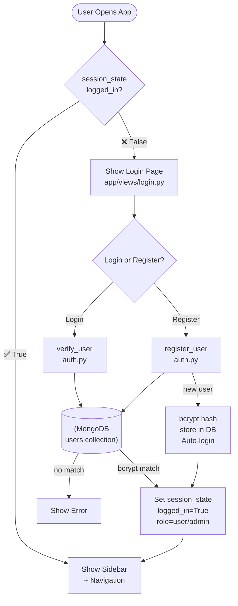
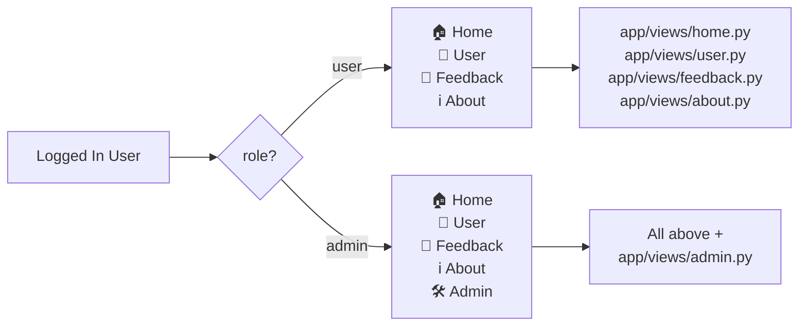
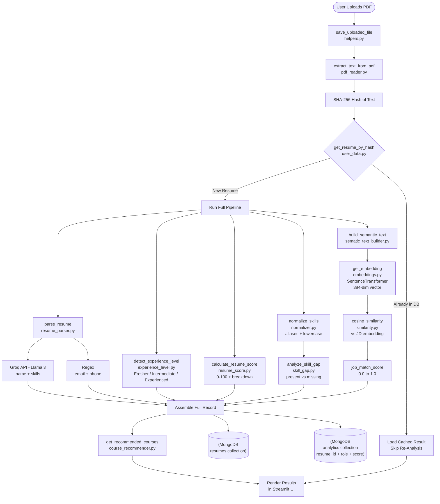
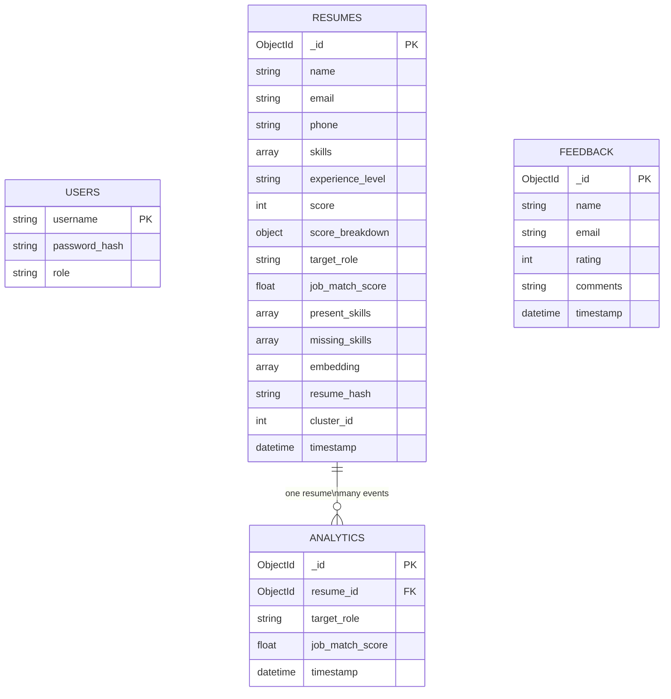
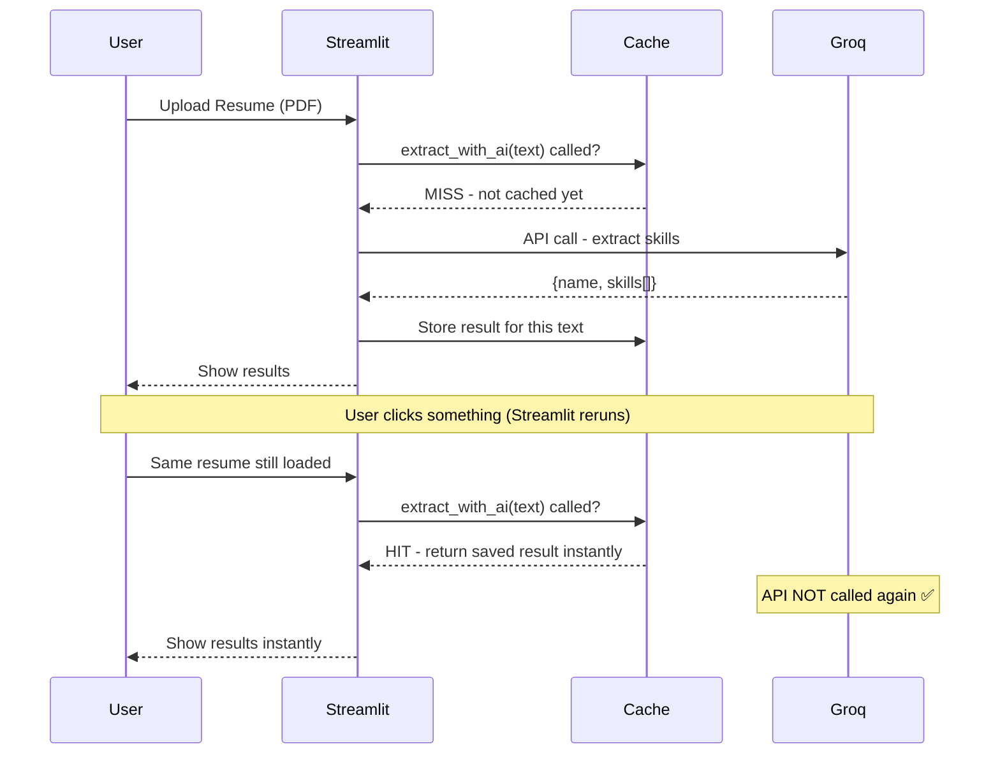
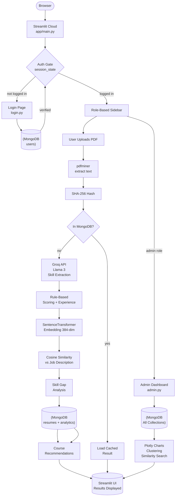
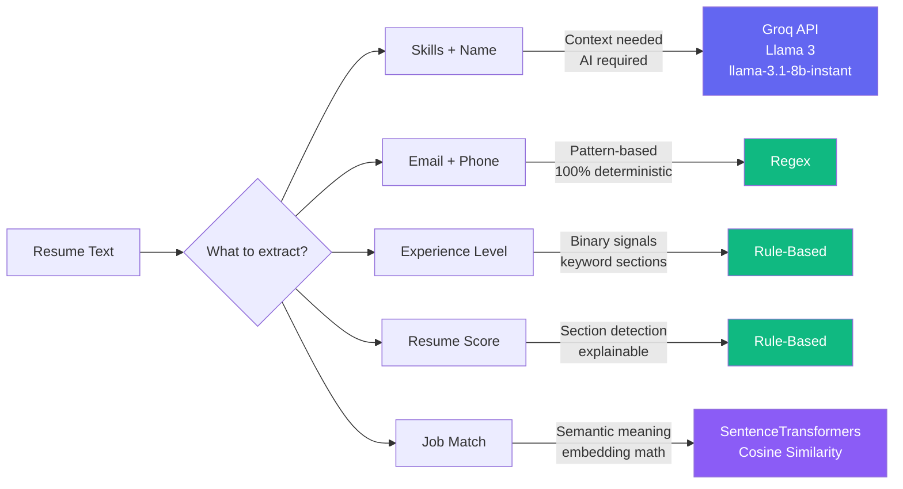

# 📄 AI Resume Analyzer — Technical Architecture & Complete Project Flow

This document details the complete end-to-end technical flow, system architecture, database schema, and module dependencies of the **AI Resume Analyzer**.

---

## 🚀 1. Application Entry Point

The system is initiated via `app/main.py` using Streamlit's runtime engine:
```bash
streamlit run app/main.py
```

### Flow Control on Startup
1. **Directory Path Setup**: Dynamically inserts the root workspace directory into `sys.path` to ensure absolute imports function properly across files.
2. **Page Configuration**: Configures page metadata (`page_title`, `page_icon="📄"`, `layout="wide"`) inside Streamlit.
3. **Session State Initialization**: Pre-allocates memory for session variables to track user logins globally across state re-runs:
   * `logged_in`: Boolean tracking current login status.
   * `username`: Name of the authenticated user.
   * `role`: Session role (`"user"` or `"admin"`).

---

## 🔐 2. Authentication Gate

The application implements a strict security gate that blocks access to any internal page unless the user has authenticated.

```
                  ┌─────────────────────────────┐
                  │      User Opens App         │
                  └──────────────┬──────────────┘
                                 │
                   [ st.session_state.logged_in? ]
                                 ├──────────────────────────────┐
                            ❌ No (False)                  ✅ Yes (True)
                                 ▼                              ▼
                      ┌─────────────────────┐        ┌─────────────────────┐
                      │  Render login_page  │        │  Render Navigation  │
                      └─────────────────────┘        └─────────────────────┘
```

### Security Engine (`backend/database/auth.py` & `app/views/login.py`)

* **🔑 Sign In Pipeline**:
  1. The user inputs their `username` and `password` on the login UI.
  2. The system invokes `verify_user(username, password)`.
  3. A query is sent to the MongoDB `users` collection to check if the username exists.
  4. Password verification is performed using **bcrypt**:
     ```python
     bcrypt.checkpw(password.encode(), stored_password_hash)
     ```
  5. If authenticated, session tokens (`logged_in`, `username`, `role`) are written to Streamlit memory and the page is refreshed (`st.rerun()`).

* **✨ Registration Pipeline**:
  1. The user fills out `username`, `password`, and `confirm_password`.
  2. If validations pass (e.g., minimum 6 characters, passwords match), the system executes `register_user(username, password, "user")`.
  3. The system hashes the password with salt:
     ```python
     password_hash = bcrypt.hashpw(password.encode(), bcrypt.gensalt())
     ```
  4. The user details are stored in the MongoDB `users` collection.
  5. The registered user is automatically logged in and session state is updated.

---

## 🗺️ 3. Navigation & Role-Based Access Control (RBAC)

Once authenticated, `app/main.py` builds the sidebar routing menu based on the user's role:

```
Role: "admin"  ──► 🏠 Home  │  👤 User  │  💬 Feedback  │  ℹ️ About  │  🛠️ Admin
Role: "user"   ──► 🏠 Home  │  👤 User  │  💬 Feedback  │  ℹ️ About
```

### Page Module Mapping
The sidebar selection maps dynamically to the following standalone modules:
* **🏠 Home**: [home.py](file:///c:/Users/ADMIN/Documents/Projects/AI_Resume_Analyzer/app/views/home.py) (Overview, system stats, quick-start guide).
* **👤 User**: [user.py](file:///c:/Users/ADMIN/Documents/Projects/AI_Resume_Analyzer/app/views/user.py) (Upload, PDF text extraction, AI parsing, matching, and recommendation dashboard).
* **💬 Feedback**: [feedback.py](file:///c:/Users/ADMIN/Documents/Projects/AI_Resume_Analyzer/app/views/feedback.py) (User satisfaction surveys, ratings, and comments).
* **ℹ️ About**: [about.py](file:///c:/Users/ADMIN/Documents/Projects/AI_Resume_Analyzer/app/views/about.py) (Author information, system details, contact form).
* **🛠️ Admin**: [admin.py](file:///c:/Users/ADMIN/Documents/Projects/AI_Resume_Analyzer/app/views/admin.py) (Analytics charts, similarity searches, clustering visualizations).

---

## 📄 4. Core Resume Analysis Pipeline

The primary system logic is driven inside [user.py](file:///c:/Users/ADMIN/Documents/Projects/AI_Resume_Analyzer/app/views/user.py) during resume uploads.

### Phase A: Extraction & Deduplication
1. **File Persistence**: The uploaded file is saved locally to the directory using `save_uploaded_file()`.
2. **Text Extraction**: Raw text is parsed from the PDF using `extract_text_from_pdf()`.
3. **Integrity Hashing**: A SHA-256 hash is generated from the raw text block:
   ```python
   resume_hash = hashlib.sha256(raw_text.encode()).hexdigest()
   ```
4. **Cache & Deduplication Lookup**:
   * The database is queried for the hash: `get_resume_by_hash(resume_hash)`.
   * **If found**: The saved analysis is retrieved instantly, skipping heavy calculations.
   * **If not found**: The engine initiates the multi-stage analysis pipeline.

---

### Phase B: Analysis & NLP Scoring Pipeline

The resume text goes through 6 parallel/sequential processors:

```
                   ┌──────────────────────────────┐
                   │       RAW RESUME TEXT        │
                   └──────────────┬───────────────┘
                                  │
      ┌───────────────────────────┼──────────────────────────┐
      ▼                           ▼                          ▼
┌──────────────┐            ┌──────────────┐           ┌──────────────┐
│  AI Parsing  │            │  Exp Level   │           │ Resume Score │
│ (Groq Llama) │            │ (Rule-Based) │           │ (Rule-Based) │
└──────┬───────┘            └──────┬───────┘           └──────┬───────┘
       │                           │                          │
       ▼                           ▼                          ▼
{name, skills[]}            "Intermediate"                 85 / 100
       │                           │                          │
       └───────────────────────────┼──────────────────────────┘
                                  ▼
                     [ Semantic Matching & Embed ]
                                  │
                                  ├─► Build semantic text block
                                  ├─► Embed resume via SentenceTransformer (384-dim)
                                  ├─► Embed Target Job Description
                                  ├─► Cosine Similarity -> Job Match Score
```

#### 1. AI Parsing (`backend/parser/resume_parser.py`)
* Extracts unstructured skills and name via **Groq's API** using `llama-3.1-8b-instant`.
* Extracts contact info (email & phone number) using robust regular expressions (Regex) for maximum speed and deterministic accuracy.

#### 2. Experience Level Detection (`backend/analysis/experience_level.py`)
* A rule-based parser searches for specific professional terms (e.g., `"years experience"`, `"intern"`, `"internship"`, `"fresher"`) combined with total page count.
* Classifies candidates into: **Fresher**, **Intermediate**, or **Experienced**.

#### 3. Quality Scoring (`backend/analysis/resume_score.py`)
* Evaluates resume content formatting and structural completeness.
* Looks for headers corresponding to standard resume sections (Summary, Education, Work Experience, Projects, Skills, Certifications) and awards specific weights up to a score of 100.

#### 4. Semantic Matching (`backend/nlp/embeddings.py` & `backend/nlp/similarity.py`)
* Resolves spelling variants and aliases using `normalize_skills()`.
* Formulates a descriptive candidate profile using `build_semantic_resume_text()`.
* Converts both the candidate profile and the target job description into 384-dimensional dense vectors using **SentenceTransformers** (`all-MiniLM-L6-v2`).
* Computes the semantic similarity between the candidate and the job profile using **Cosine Similarity**:
  $$\text{Similarity} = \frac{\mathbf{A} \cdot \mathbf{B}}{\|\mathbf{A}\| \|\mathbf{B}\|}$$

---

### Phase C: Data Persistence & Recommendation

1. **MongoDB Write**:
   * The analyzed resume is stored in the `resumes` collection.
   * A separate analytic logging record is inserted in the `analytics` collection to record this calculation event.
2. **Career Recommendations (`backend/recommender/course_recommender.py`)**:
   * Identifies candidate missing skills by comparing resume skills against the target role requirements.
   * Maps missing skills directly to a curated dictionary of online certifications, video courses, and interview preparation guides.

---

## 🛠️ 5. Admin Dashboard Architecture

The Admin dashboard ([admin.py](file:///c:/Users/ADMIN/Documents/Projects/AI_Resume_Analyzer/app/views/admin.py)) provides cross-portfolio insights using visual widgets.

### Data Analytics & Aggregation
* **Global Missing Skills**: Counts missing skills across all uploaded resumes using python's `Counter` to show skill gaps.
* **Experience & Performance Split**: Renders Plotly pie charts and bar charts summarizing matching score distributions and role metrics.

### Machine Learning Insights
* **🔍 Semantic Similarity Search**:
  1. The administrator inputs a text query (e.g., `"React developer with AWS knowledge"`).
  2. The query is converted into a vector embedding using the same SentenceTransformer model.
  3. A vector search is executed using cosine similarity against all stored embeddings in MongoDB.
  4. Returns the top matches ranked by relevance.
* **📦 KMeans Resume Clustering**:
  1. Loads all 384-dimensional embeddings from the database.
  2. Runs a **K-Means clustering algorithm** to group resumes based on semantic similarities.
  3. Updates cluster assignments (`cluster_id`) in MongoDB.
  4. Uses Principal Component Analysis (PCA) to project the high-dimensional clusters onto a 2D Plotly scatter plot.

---

## 🗄️ 6. Database Collections Schema

MongoDB database schema details:

### 1. `users` Collection
Stores credential hashes and authorization levels.
```json
{
  "_id": "ObjectId",
  "username": "admin",
  "password_hash": "$2b$12$...", // bcrypt salted hash
  "role": "admin" // "user" | "admin"
}
```

### 2. `resumes` Collection
Stores full analysis records for unique resumes (keyed on raw text SHA-256 hash).
```json
{
  "_id": "ObjectId",
  "name": "Chidvilas",
  "email": "candidate@example.com",
  "phone": "9876543210",
  "skills": ["Python", "Streamlit", "MongoDB"],
  "experience_level": "Intermediate",
  "score": 85,
  "score_breakdown": {
    "has_summary": true,
    "has_education": true,
    "has_experience": true
  },
  "target_role": "Data Scientist",
  "job_match_score": 0.78,
  "present_skills": ["Python", "MongoDB"],
  "missing_skills": ["SQL", "Machine Learning"],
  "embedding": [0.012, -0.045, ...], // 384-dimensional vector
  "resume_hash": "a1b2c3d4...", // SHA-256 unique string
  "cluster_id": 2, // Assigned via K-Means
  "timestamp": "ISODate"
}
```

### 3. `analytics` Collection
Event log tracking every analysis query. Features a **one-to-many relationship** (One resume can link to multiple analysis runs for different target roles).
```json
{
  "_id": "ObjectId",
  "resume_id": "ObjectId", // References resumes._id
  "target_role": "Machine Learning Engineer",
  "job_match_score": 0.81,
  "timestamp": "ISODate"
}
```

### 4. `feedback` Collection
Stores user reviews, comments, and satisfaction metrics.
```json
{
  "_id": "ObjectId",
  "name": "User Name",
  "email": "user@example.com",
  "rating": 5, // 1 to 5 stars
  "comments": "This tool is amazing!",
  "timestamp": "ISODate"
}
```

---

## 📊 7. System Architecture & Flow Diagrams

Here is a visual breakdown of the structural interactions within the system.

### 1. Authentication Gate



---

### 2. Role-Based Navigation



---

### 3. Resume Analysis Pipeline



---

### 4. MongoDB ER Diagram



---

### 5. Caching Behaviour



---

### 6. End-to-End System Flow



---

### 7. AI vs Rule-Based Decision Map


